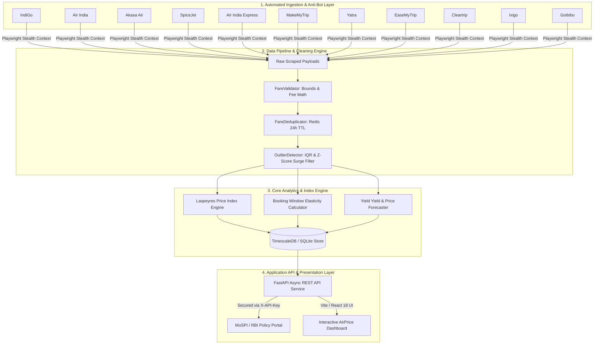

# ✈️ AirPrice APIx — Real-Time Airfare Price Index Platform for India

> **MoSPI Smart India Hackathon (Problem Statement ID: 26056)**  
> **Title:** Development of a Real-time Airfare Price Index for India through Automated Web Scraping of Airline and Online Travel Aggregator (OTA) Portals for Augmentation of the Consumer Price Index (CPI).


---

## 📌 Executive Summary

The Consumer Price Index (CPI) released by the **National Statistical Office (NSO), Ministry of Statistics and Programme Implementation (MoSPI)**, is the primary measure of retail inflation in India, guiding monetary policy decisions by the Reserve Bank of India (RBI).

Historically, the CPI 'Transport and Communication' sub-group collected air travel fares primarily through manual price collection at physical ticketing outlets. Today, over **90% of domestic air tickets in India are purchased online** via airline websites and Online Travel Aggregators (OTAs). 

**AirPrice APIx** modernizes this framework by delivering an automated, production-grade platform that:
1. **Scrapes real-time domestic airfares** every 2 hours across **11 major portals** (5 domestic airlines + 6 OTAs).
2. **Monitors 50 representative DGCA corridors** weighted by official passenger volume across **5 booking lead windows** ($T+1$, $T+7$, $T+15$, $T+30$, $T+45$).
3. **Filters price anomalies** using Interquartile Range (IQR) statistical surge detection.
4. **Calculates the Laspeyres Price Index (APIx)** to provide a high-frequency, real-time index to augment official monthly CPI data.
5. **Provides interactive decision-support dashboards** for policy analysts, travelers, and researchers.

---

## 🏗️ Architecture & Data Pipeline Flow



---

## ✨ Key Platform Features

### 🛰️ 1. 11-Source Multi-Portal Scraper Engine
Extracts live spot prices, taxes, convenience fees, flight numbers, and seat availabilities across:
* **5 Domestic Airlines**: IndiGo, Air India, Akasa Air, SpiceJet, Air India Express.
* **6 Online Travel Aggregators (OTAs)**: MakeMyTrip, Yatra, EaseMyTrip, Cleartrip, Ixigo, Goibibo.

### 🛡️ 2. Anti-Bot & Anti-Detection Architecture
* **Playwright Stealth Contexts**: Emulates human browser fingerprints and navigations.
* **User-Agent Pool Rotation**: Randomized desktop Chrome / Safari / Firefox user agent strings.
* **DOM Parsing Fallbacks**: Resilient BeautifulSoup extraction coupled with fallback calibrated data generation so the API never experiences downtime.

### 📊 3. Laspeyres Airfare Price Index (APIx) Engine
* **Formula**:
  $$I_t = \frac{\sum_{i=1}^{n} P_{i,t} \cdot Q_{i,0}}{\sum_{i=1}^{n} P_{i,0} \cdot Q_{i,0}} \times 100$$
* **DGCA Passenger Weighting**: Calibrated across top 50 domestic routes (e.g., DEL-BOM: 15.0%, DEL-BLR: 12.5%, BOM-BLR: 10.0%).
* **Base Value**: Normalized base index value ($100.00$) calculated daily and aggregated into weekly/monthly series.

### 📅 4. Lead-Time Booking Elasticity ("When to Book")
* Analyzes price changes across 5 booking lead times: $T+1$ (Spot), $T+7$, $T+15$, $T+30$, and $T+45$ (Advance).
* Computes savings curves and carrier-specific pricing matrices to identify optimal booking windows.

### ⚠️ 5. IQR Anomaly & Fare Shock Detection
* Uses Interquartile Range thresholds ($Q_1 - 1.5 \times \text{IQR}$ to $Q_3 + 1.5 \times \text{IQR}$) to detect artificial slot compression, demand spikes, or price gouging.

### 💻 6. MoSPI-Inspired Interactive Dashboard
* **Overview View**: National APIx ticker, route search, interactive SVG map of India, corridor pricing tables.
* **CPI Augmentation View**: Side-by-side comparison of official MoSPI CPI vs. Real-Time APIx index.
* **When to Book View**: Interactive lead-time elasticity curves and airline carrier comparison grids.
* **Fare Forecast View**: AI-driven 7-day, 15-day, and 30-day price trend projections per airline & flight.
* **System Health Telemetry**: Live status of APScheduler, API latency, and database connections with real-time countdowns.
* **Multilingual Support**: Supports both **English** and **Hindi (हिंदी)** out of the box.

---

## 🛠️ Technology Stack

| Domain | Technology | Purpose |
| :--- | :--- | :--- |
| **Frontend Framework** | **React 18 + Vite 5** | High-performance SPA frontend |
| **Language & Styling** | **TypeScript + Tailwind CSS** | Type safety & modern MoSPI design UI |
| **Visualization** | **Recharts + Lucide Icons** | Interactive line charts, bar breakdown, SVG route maps |
| **Backend Framework** | **Python 3.11+ / FastAPI** | High-throughput asynchronous REST API |
| **Scheduler** | **APScheduler (AsyncIO)** | Automated 2-hour crawling & 10 AM daily APIx calculation |
| **Scraping Engine** | **Playwright Stealth + BeautifulSoup4** | Headless browser automation & DOM parsing |
| **Data Validation** | **Pydantic v2** | Data contract enforcement & schema validation |
| **Database & Cache** | **SQLite / PostgreSQL + Redis** | Time-series index storage & deduplication caching |
| **Testing** | **Pytest + Pytest-Asyncio** | Automated test suite for calculators & API endpoints |
| **Containerization** | **Docker + Docker Compose** | Multi-container deployment |
| **Hosting & Deploy** | **Vercel** (Frontend) & **Render** (Backend) | Production hosting |

---

## 📁 Project Directory Structure

```text
Airfare Project/
├── app/                        # FastAPI Backend Application
│   ├── api/                    # REST API Route Handlers & Auth Middleware
│   │   ├── auth.py             # X-API-Key Security verification
│   │   └── routes.py           # All API Endpoints (/apix, /routes, /alerts, /forecast)
│   ├── index_calculator/       # Core Mathematical Engines
│   │   ├── calculator.py       # Laspeyres Index Calculator (APIx)
│   │   ├── outlier_detection.py# IQR & Z-Score Anomaly Detector
│   │   └── data_cleaner.py     # Data Normalizer
│   ├── scrapers/               # 11 Source Web Scrapers
│   │   ├── base.py             # BaseScraper class with Playwright integration
│   │   ├── indigo.py, airindia.py, akasa.py, spicejet.py, aiexpress.py
│   │   └── makemytrip.py, yatra.py, easemytrip.py, cleartrip.py, ixigo.py, goibibo.py
│   ├── processors/             # Data Processing Pipeline (Validator, Deduplicator)
│   ├── config.py               # Application Settings & Pydantic Config
│   ├── database.py             # Database Engine (Async SQLAlchemy, SQLite / Postgres)
│   └── main.py                 # FastAPI Application entry point & APScheduler daemon
├── Frontend/                   # React 18 + Vite Frontend Application
│   ├── public/                 # Static Assets
│   ├── src/
│   │   ├── components/
│   │   │   ├── charts/         # Recharts components (LineChart, RouteTrend, Inflation)
│   │   │   ├── layout/         # Dashboard layout, Navbar, Sidebar
│   │   │   ├── modals/         # Fare Alert & Explainer Modals
│   │   │   ├── views/          # 8 Core Dashboard Views (Overview, CPI, Forecast, etc.)
│   │   │   └── IndiaMap.tsx    # Interactive SVG India Flight Corridor Map
│   │   ├── i18n/               # English & Hindi Translations
│   │   ├── services/           # Axios / Fetch API Service Layer (api.ts)
│   │   └── types.ts            # TypeScript interfaces
│   ├── package.json
│   ├── vercel.json             # Vercel SPA Routing Fallback
│   └── vite.config.ts
├── data/                       # Scraped Fares JSON/CSV Output & DGCA Corridor Weights
├── scripts/                    # Utility Execution Scripts
│   ├── run_scraper.py          # Batch scraping execution runner
│   └── scrape_easemytrip_live.py # Live browser web scraper script
├── tests/                      # Pytest Test Suite
│   ├── test_api.py             # API Endpoint Tests
│   └── test_calculator.py      # Laspeyres Index Unit Tests
├── Dockerfile                  # Production Docker Build File
├── render.yaml                 # Render Blueprint Deployment Configuration
├── requirements.txt            # Python Dependencies
└── README.md
```

---

## ⚡ Quickstart & Local Setup

### 1. Backend Setup (FastAPI)

```bash
# Clone the repository
git clone https://github.com/HardikMathur11/AirPrice-Apix.git
cd "AirPrice-Apix"

# Install Python dependencies
pip install -r requirements.txt

# Install Playwright Chromium browser
python -m playwright install --with-deps chromium

# Run backend development server
python -m uvicorn app.main:app --reload --port 8000
```
👉 Interactive OpenAPI Documentation available at: `http://localhost:8000/docs`

---

### 2. Frontend Setup (React + Vite)

```bash
# Navigate to Frontend directory
cd Frontend

# Install Node modules
npm install

# Start development server
npm run dev
```
👉 Access Dashboard in browser: `http://localhost:3000` (or `http://localhost:5173`)

---

### 3. Run Automated Tests & Scrapers

```bash
# Run pytest test suite (10 passed tests)
python -m pytest

# Run batch scraping runner
python scripts/run_scraper.py
```

---

## 🔌 REST API Reference

All endpoints are protected by default via the `X-API-Key` header (Demo Key: `airprice_demo_key_2026`).

| Method | Endpoint | Description |
| :--- | :--- | :--- |
| `GET` | `/` | Root welcome endpoint and API status |
| `GET` | `/health` | System telemetry, DB status & APScheduler next run time |
| `GET` | `/api/v1/apix/current` | Current daily APIx index value and 1d/7d/30d period changes |
| `GET` | `/api/v1/apix/historical` | Historical APIx index time-series (`daily`, `weekly`, `monthly`) |
| `GET` | `/api/v1/routes` | Monitored 50 DGCA routes with traffic volume weights |
| `GET` | `/api/v1/routes/{route_code}/prices` | Real-time fare breakdown across 11 sources for window $T+1$ to $T+45$ |
| `GET` | `/api/v1/routes/{route_code}/elasticity` | Lead-time booking elasticity curve & carrier pricing breakdown |
| `GET` | `/api/v1/routes/{route_code}/forecast` | AI price forecasts per flight number & airline carrier |
| `GET` | `/api/v1/alerts` | Real-time IQR fare shock anomalies & price surge alerts |

---

## 🚀 Deployment Guide

### Deploying Backend to Render (Docker)
1. Go to [Render Dashboard](https://dashboard.render.com/) and create a **New Blueprint** or **Web Service**.
2. Connect repository `HardikMathur11/AirPrice-Apix`.
3. Render auto-detects `render.yaml` or set **Language** to `Docker`.
4. Click **Deploy Web Service**.
5. Copy your live backend URL (e.g. `https://airprice-apix-backend.onrender.com`).

### Deploying Frontend to Vercel
1. Go to [Vercel Dashboard](https://vercel.com/dashboard) and click **Add New Project**.
2. Import repository `HardikMathur11/AirPrice-Apix`.
3. Set **Root Directory** to `Frontend`.
4. Add Environment Variable:
   * `VITE_API_BASE_URL` = `https://airprice-apix-backend.onrender.com`
5. Click **Deploy**.

---

## 📄 License & Attribution

Developed for **Ministry of Statistics and Programme Implementation (MoSPI)** under **Smart India Hackathon (SIH 2026 / ID: 26056)**.

Licensed under the [MIT License](LICENSE).
