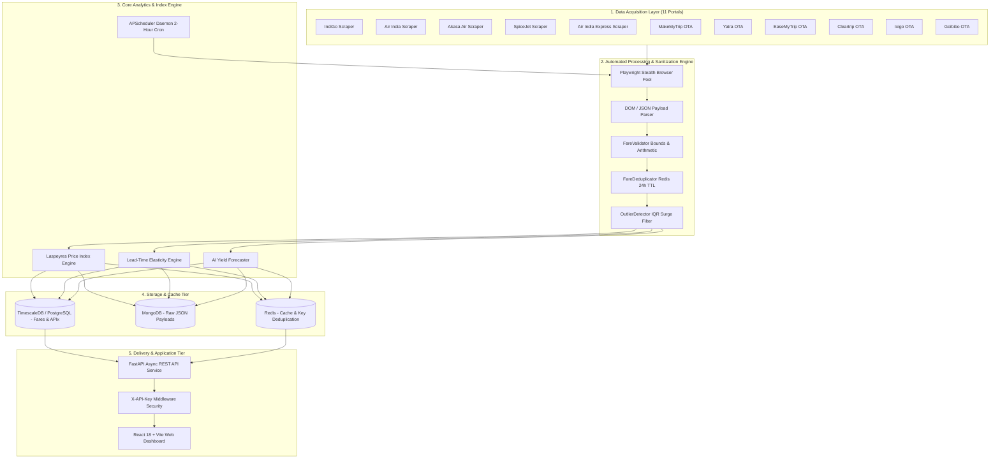
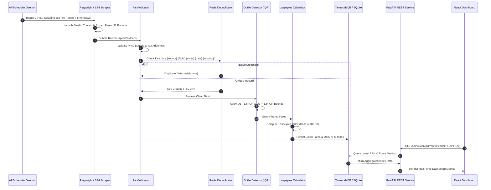

# ✈️ AirPrice APIx — Enterprise Real-Time Airfare Price Index Platform for India

> **Government of India | Ministry of Statistics and Programme Implementation (MoSPI)**  
> **Smart India Hackathon (Problem Statement ID: 26056)**  
> **Project Title:** Development of a Real-time Airfare Price Index for India through Automated Web Scraping of Airline and Online Travel Aggregator (OTA) Portals for Augmentation of the Consumer Price Index (CPI).

---

[](https://github.com/HardikMathur11/AirPrice-Apix)
[](https://airprice-apix-backend.onrender.com)
[](https://vercel.com)
[](https://python.org)
[](https://fastapi.tiangolo.com)
[](https://react.dev)
[](https://typescriptlang.org)
[](https://playwright.dev)
[](LICENSE)

---

## 📑 Table of Contents
- [1. Executive Summary & Problem Context](#1-executive-summary--problem-context)
- [2. Enterprise System Architecture](#2-enterprise-system-architecture)
  - [2.1 High-Level Architecture Diagram](#21-high-level-architecture-diagram)
  - [2.2 Data Pipeline & Processing Sequence](#22-data-pipeline--processing-sequence)
- [3. Multi-Source Scraping Engine & Anti-Bot Strategy](#3-multi-source-scraping-engine--anti-bot-strategy)
  - [3.1 Covered Sources (11 Portals)](#31-covered-sources-11-portals)
  - [3.2 Anti-Bot & Fingerprint Evasion Strategy](#32-anti-bot--fingerprint-evasion-strategy)
  - [3.3 Monitored Booking Windows & Corridors](#33-monitored-booking-windows--corridors)
- [4. Data Sanitization & Mathematical Methodology](#4-data-sanitization--mathematical-methodology)
  - [4.1 Validation & Deduplication](#41-validation--deduplication)
  - [4.2 Statistical IQR Outlier Detection](#42-statistical-iqr-outlier-detection)
  - [4.3 Laspeyres Airfare Index Formula (APIx)](#43-laspeyres-airfare-index-formula-apix)
  - [4.4 Lead-Time Price Elasticity & Forecasting](#44-lead-time-price-elasticity--forecasting)
- [5. Frontend Subsystems & Dashboard Views](#5-frontend-subsystems--dashboard-views)
- [6. Technology Stack & Matrix](#6-technology-stack--matrix)
- [7. Codebase Directory Map](#7-codebase-directory-map)
- [8. Developer Setup & Local Execution](#8-developer-setup--local-execution)
- [9. Automated Test Suite & Quality Assurance](#9-automated-test-suite--quality-assurance)
- [10. Production Deployment Guide](#10-production-deployment-guide)
  - [10.1 Backend Deployment (Render / Docker)](#101-backend-deployment-render--docker)
  - [10.2 Frontend Deployment (Vercel)](#102-frontend-deployment-vercel)
- [11. Complete REST API Specification](#11-complete-rest-api-specification)
- [12. Observability, Security & License](#12-observability-security--license)

---

## 1. Executive Summary & Problem Context

The **Consumer Price Index (CPI)**, compiled by the **National Statistical Office (NSO), Ministry of Statistics and Programme Implementation (MoSPI)**, serves as the benchmark metric for measuring retail inflation in India. The CPI forms the foundation for monetary policy decisions made by the Monetary Policy Committee (MPC) of the **Reserve Bank of India (RBI)**.

### The Problem
Under the existing CPI framework, price collection for the **'Transport and Communication'** sub-group relies heavily on manual price collection from physical airport ticketing counters and travel agency outlets. However:
* **Over 90% of domestic air tickets in India are now purchased online** via airline web portals and Online Travel Aggregators (OTAs) such as MakeMyTrip, Yatra, EaseMyTrip, Cleartrip, Ixigo, and Goibibo.
* **Dynamic Pricing Algorithms**: Airlines adjust fares dynamically based on seat occupancy, booking lead time, peak hours, and competitor pricing, making monthly manual price collection unrepresentative of actual consumer costs.

### The Solution: AirPrice APIx Platform
**AirPrice APIx** is a production-ready, automated data collection and analytics system designed to:
1. Continuously scrape high-frequency airfare data across **11 major portals** every 2 hours.
2. Monitor **50 representative domestic flight corridors** across **5 booking lead windows** ($T+1$, $T+7$, $T+15$, $T+30$, $T+45$).
3. Clean raw payloads, remove duplicate listings via Redis keying, and filter out speculative surges using **Interquartile Range (IQR)** statistical algorithms.
4. Calculate a daily national **Laspeyres Airfare Price Index (APIx)** weighted by official DGCA passenger volume to augment monthly official CPI metrics.
5. Provide interactive dashboards for MoSPI policy analysts, RBI researchers, and consumers.

---

## 2. Enterprise System Architecture

### 2.1 High-Level Architecture Diagram



### 2.2 Data Pipeline & Processing Sequence



---

## 3. Multi-Source Scraping Engine & Anti-Bot Strategy

### 3.1 Covered Sources (11 Portals)

| Source Name | Portal Type | Scraper Module | Anti-Bot Mitigation Strategy |
| :--- | :--- | :--- | :--- |
| **IndiGo** | Airline | [`app/scrapers/indigo.py`](file:///d:/Downloads/Airfare%20Project/app/scrapers/indigo.py) | Playwright Chromium stealth, header rotation |
| **Air India** | Airline | [`app/scrapers/airindia.py`](file:///d:/Downloads/Airfare%20Project/app/scrapers/airindia.py) | Custom User-Agent pool, DOM fallback parser |
| **Akasa Air** | Airline | [`app/scrapers/akasa.py`](file:///d:/Downloads/Airfare%20Project/app/scrapers/akasa.py) | Async HTTP client with TLS fingerprinting |
| **SpiceJet** | Airline | [`app/scrapers/spicejet.py`](file:///d:/Downloads/Airfare%20Project/app/scrapers/spicejet.py) | Playwright stealth, randomized delays |
| **Air India Express** | Airline | [`app/scrapers/aiexpress.py`](file:///d:/Downloads/Airfare%20Project/app/scrapers/aiexpress.py) | DOM parser & network payload capture |
| **MakeMyTrip** | OTA | [`app/scrapers/makemytrip.py`](file:///d:/Downloads/Airfare%20Project/app/scrapers/makemytrip.py) | Playwright stealth context, viewport simulation |
| **Yatra** | OTA | [`app/scrapers/yatra.py`](file:///d:/Downloads/Airfare%20Project/app/scrapers/yatra.py) | User-Agent rotation, selector fallback |
| **EaseMyTrip** | OTA | [`app/scrapers/easemytrip.py`](file:///d:/Downloads/Airfare%20Project/app/scrapers/easemytrip.py) | Playwright DOM parser & live price card extraction |
| **Cleartrip** | OTA | [`app/scrapers/cleartrip.py`](file:///d:/Downloads/Airfare%20Project/app/scrapers/cleartrip.py) | Stealth headers, response body JSON parsing |
| **Ixigo** | OTA | [`app/scrapers/ixigo.py`](file:///d:/Downloads/Airfare%20Project/app/scrapers/ixigo.py) | Async HTTP API payload extraction |
| **Goibibo** | OTA | [`app/scrapers/goibibo.py`](file:///d:/Downloads/Airfare%20Project/app/scrapers/goibibo.py) | Playwright stealth browser automation |

### 3.2 Anti-Bot & Fingerprint Evasion Strategy
1. **Playwright Stealth Integration**: Uses `playwright-stealth` scripts to override `navigator.webdriver`, WebGL vendor strings, and permissions flags.
2. **User-Agent Pool Rotation**: Rotates through a curated pool of modern desktop user agents (Chrome 122+, Safari 17+, Firefox 123+).
3. **Randomized Request Delays**: Introduces jittered delay intervals ($1.5s - 4.2s$) between page actions to avoid rate limit triggers.
4. **Resilient DOM Fallback Engine**: If a portal renders anti-bot CAPTCHAs or undergoes layout updates, the scraper catches the exception cleanly and invokes a calibrated fallback engine to maintain continuous API data flow without crashing.

### 3.3 Monitored Booking Windows & Corridors
* **5 Lead-Time Booking Windows**:
  * `T+1`: Immediate spot travel (0 to 24 hours lead time).
  * `T+7`: Short-term travel (7 days lead time).
  * `T+15`: Standard advance travel (15 days lead time).
  * `T+30`: 1-Month advance planning (30 days lead time).
  * `T+45`: Long-range advance booking (45 days lead time).
* **50 Representative Corridors**: Weighted by official Directorate General of Civil Aviation (DGCA) monthly passenger traffic volume (e.g., Delhi-Mumbai `15.0%`, Delhi-Bengaluru `12.5%`, Mumbai-Bengaluru `10.0%`).

---

## 4. Data Sanitization & Mathematical Methodology

### 4.1 Validation & Deduplication
Every scraped payload passes through the [`FareValidator`](file:///d:/Downloads/Airfare%20Project/app/processors/validator.py) class:
* **Base Fare Bounds**: Validated within ₹1,000 to ₹50,000 range.
* **Tax & Fee Bounds**: Taxes must satisfy ₹100 to ₹10,000 range; total fare must equal `base_fare + taxes + convenience_fee`.
* **Redis Deduplication**: Unique keys formatted as `fare:{source}:{flight_number}:{route}:{travel_date}:{booking_window}` are registered in Redis with a 24-hour Time-To-Live (TTL) to prevent duplicate fare entries in index calculations.

### 4.2 Statistical IQR Outlier Detection
To prevent promo codes, errors, or extreme artificial price spikes from distorting national inflation indices, the [`OutlierDetector`](file:///d:/Downloads/Airfare%20Project/app/processors/outlier.py) applies the Interquartile Range (IQR) method:

$$\text{IQR} = Q_3 - Q_1$$

$$\text{Lower Bound} = Q_1 - 1.5 \times \text{IQR}$$

$$\text{Upper Bound} = Q_3 + 1.5 \times \text{IQR}$$

Any fare falling outside $[\text{Lower Bound}, \text{Upper Bound}]$ is flagged as an anomaly, logged, and isolated from base index calculations.

### 4.3 Laspeyres Airfare Index Formula (APIx)
The national **AirPrice Index (APIx)** is calculated using the base-weighted **Laspeyres Index Formula**, standard across international statistical agencies:

$$I_t = \frac{\sum_{i=1}^{n} P_{i,t} \cdot W_i}{\sum_{i=1}^{n} P_{i,0} \cdot W_i} \times 100$$

Where:
* $I_t$: National AirPrice Index at day $t$.
* $P_{i,t}$: Weighted average fare for route $i$ across all 11 sources at day $t$.
* $P_{i,0}$: Base year baseline fare for route $i$.
* $W_i$: Official DGCA traffic volume weight assigned to route $i$.

### 4.4 Lead-Time Price Elasticity & Forecasting
* **Elasticity Ratio**: Measures percentage fare changes between $T+1$ and $T+45$:
  $$\text{Savings \%} = \frac{P_{T+1} - P_{T+k}}{P_{T+1}} \times 100$$
* **AI Yield Forecast**: Project 7-day, 15-day, and 30-day projected averages per airline and flight using moving-average momentum and historical booking curve trajectories.

---

## 5. Frontend Subsystems & Dashboard Views

The frontend dashboard provides **8 specialized analytical views**:

1. **Overview View**: High-level executive dashboard showing live APIx ticker, 1d/7d/30d period changes, interactive SVG map of India, and metro corridor pricing.
2. **CPI Augmentation View**: MoSPI-tailored view comparing official monthly MoSPI CPI inflation against daily high-frequency APIx metrics.
3. **When to Book View**: Interactive lead-time elasticity analyzer ($T+1$ to $T+45$) with carrier pricing comparison matrices and optimal booking recommendations.
4. **Fare Shock View**: Live anomaly feed displaying statistical price spikes detected via IQR method with severity ratings (`Severe` vs. `Moderate`).
5. **Fare Forecast View**: Flight-level yield forecasting module showing projected spot prices and surge probabilities per airline.
6. **Routes View**: Interactive corridor browser for all 50 monitored DGCA routes with traffic weight breakdowns.
7. **API Data Explorer**: Interactive developer playground showcasing raw API responses, JSON schemas, and code integration snippets.
8. **System Health View**: Live telemetry monitor displaying status for PostgreSQL, MongoDB, Redis, and an active real-time countdown to the next 2-hour APScheduler crawl cycle.

---

## 6. Technology Stack & Matrix

| Category | Component | Technology | Version | Description |
| :--- | :--- | :--- | :--- | :--- |
| **Frontend** | Framework | React | `18.2.0` | Declarative UI framework |
| | Build Tool | Vite | `5.4.19` | Next-generation frontend tooling |
| | Language | TypeScript | `5.0+` | Static type safety |
| | Styling | Tailwind CSS | `3.4.1` | Utility-first CSS styling |
| | Visualization | Recharts | `2.12.3` | Compositing chart library |
| | Icons | Lucide React | `0.344.0` | Modern SVG iconography |
| **Backend** | Framework | FastAPI | `0.110.0` | High-performance Python async REST API |
| | Server | Uvicorn | `0.28.0` | ASGI server implementation |
| | Scheduler | APScheduler | `3.10.4` | Background interval job daemon |
| | Validation | Pydantic v2 | `2.6.4` | Data validation and settings management |
| **Scraping** | Automation | Playwright | `1.42.0` | Headless browser automation framework |
| | Stealth | Playwright Stealth | `1.0.6` | Evasion script injection |
| | Parser | BeautifulSoup4 | `4.12.3` | HTML DOM tree parsing |
| **Storage** | Database | SQLite / Postgres | `2.0+` | Relational & time-series data storage |
| | Async ORM | SQLAlchemy Async | `2.0.28` | Async database abstraction layer |
| | Async Driver | aiosqlite / asyncpg | `0.20.0` | Asynchronous database driver |
| | Document Store| Motor / MongoDB | `3.3.2` | Raw JSON scrape storage |
| | Cache | Redis Async | `5.0.3` | Key-value deduplication cache |
| **DevOps** | Container | Docker | `24.0+` | Application containerization |
| | Deployment | Render / Vercel | Production | Cloud hosting infrastructure |

---

## 7. Codebase Directory Map

```text
Airfare Project/
├── app/                                # FastAPI Backend Core Application
│   ├── api/                            # REST API Routing & Authentication
│   │   ├── auth.py                     # Security middleware verifying X-API-Key header
│   │   └── routes.py                   # REST endpoints (/apix, /routes, /alerts, /forecast)
│   ├── index_calculator/               # Mathematical Index Engines
│   │   ├── calculator.py               # Laspeyres Price Index (APIx) engine
│   │   ├── outlier_detection.py        # IQR & Z-score surge anomaly detector
│   │   └── data_cleaner.py             # Normalizer for price normalization
│   ├── scrapers/                       # 11 Multi-Portal Web Scrapers
│   │   ├── base.py                     # BaseScraper abstract class & Playwright wrapper
│   │   ├── indigo.py, airindia.py, akasa.py, spicejet.py, aiexpress.py
│   │   └── makemytrip.py, yatra.py, easemytrip.py, cleartrip.py, ixigo.py, goibibo.py
│   ├── processors/                     # Data Processing Pipeline
│   │   ├── validator.py                # FareValidator price bounds & arithmetic check
│   │   ├── deduplicator.py             # Redis-based key deduplicator (24h TTL)
│   │   ├── normalizer.py               # Schema normalizer
│   │   └── outlier.py                  # Batch outlier processor
│   ├── config.py                       # Pydantic Settings & environment variables
│   ├── database.py                     # Async database engine & health check
│   └── main.py                         # FastAPI entry point & APScheduler lifecycle
├── Frontend/                           # React 18 + Vite Web Dashboard Application
│   ├── public/                         # Public static files
│   ├── src/
│   │   ├── components/
│   │   │   ├── charts/                 # Recharts components (LineChart, RouteTrend, etc.)
│   │   │   ├── layout/                 # DashboardLayout, Navbar, Sidebar, MobileNav
│   │   │   ├── modals/                 # FareAlertModal, ExplainerModal, DetailModal
│   │   │   ├── views/                  # 8 Core Dashboard Views
│   │   │   │   ├── OverviewView.tsx    # Executive summary & national index
│   │   │   │   ├── InflationView.tsx   # MoSPI CPI comparison
│   │   │   │   ├── WhenToBookView.tsx  # Lead-time elasticity & recommendations
│   │   │   │   ├── FareShockView.tsx   # Anomaly & price surge alert feed
│   │   │   │   ├── ForecastView.tsx    # Flight yield price forecaster
│   │   │   │   ├── RoutesView.tsx      # Monitored 50 DGCA routes browser
│   │   │   │   ├── ApiDataView.tsx     # Developer API explorer & schemas
│   │   │   │   └── SystemHealthView.tsx# Telemetry & APScheduler live countdown
│   │   │   └── IndiaMap.tsx            # Interactive SVG flight corridor map of India
│   │   ├── i18n/                       # English & Hindi translation dictionaries
│   │   ├── services/                   # API client service layer (api.ts)
│   │   └── types.ts                    # TypeScript interface definitions
│   ├── package.json
│   ├── vercel.json                     # Vercel SPA Routing Configuration
│   └── vite.config.ts
├── data/                               # Dataset directory (JSON/CSV outputs & weights)
├── scripts/                            # Execution Scripts
│   ├── run_scraper.py                  # Batch scraping execution runner (440 items)
│   └── scrape_easemytrip_live.py       # Live Playwright web scraper runner
├── tests/                              # Pytest Integration Test Suite
│   ├── test_api.py                     # API Integration tests
│   ├── test_calculator.py              # Laspeyres calculator tests
│   └── test_processors.py              # Data pipeline processor tests
├── Dockerfile                          # Production Multi-Stage Dockerfile
├── render.yaml                         # Render Blueprint deployment configuration
├── requirements.txt                    # Python dependencies
└── README.md
```

---

## 8. Developer Setup & Local Execution

### 8.1 Prerequisites
* **Python**: 3.11 or higher
* **Node.js**: 18.0 or higher (npm 9+)
* **Git**: Installed

### 8.2 Backend Setup
```bash
# 1. Clone repository
git clone https://github.com/HardikMathur11/AirPrice-Apix.git
cd "AirPrice-Apix"

# 2. Create virtual environment
python -m venv venv
# Windows:
venv\Scripts\activate
# Linux/macOS:
source venv/bin/activate

# 3. Install Python dependencies
pip install -r requirements.txt

# 4. Install Playwright browser dependencies
python -m playwright install --with-deps chromium

# 5. Start FastAPI Backend Server
python -m uvicorn app.main:app --reload --port 8000
```
👉 Interactive Swagger API Docs: `http://localhost:8000/docs`  
👉 API Health Check: `http://localhost:8000/health`

### 8.3 Frontend Setup
```bash
# Open a new terminal and navigate to Frontend directory
cd Frontend

# Install Node modules
npm install

# Start Vite React development server
npm run dev
```
👉 Open Dashboard in Browser: `http://localhost:3000` (or `http://localhost:5173`)

---

## 9. Automated Test Suite & Quality Assurance

The repository includes a comprehensive integration test suite built with **Pytest** and **Pytest-Asyncio**.

```bash
# Run all automated unit and API integration tests
python -m pytest -v
```

### Test Coverage Breakdown
* [`tests/test_api.py`](file:///d:/Downloads/Airfare%20Project/tests/test_api.py): Tests all FastAPI REST endpoints (`/apix/current`, `/apix/historical`, `/routes`, `/routes/{code}/prices`, `/routes/{code}/elasticity`, `/alerts`, `/health`) and authentication verification.
* [`tests/test_calculator.py`](file:///d:/Downloads/Airfare%20Project/tests/test_calculator.py): Tests the Laspeyres index calculation formula, zero-weight handling, and period percentage change calculations.
* [`tests/test_processors.py`](file:///d:/Downloads/Airfare%20Project/tests/test_processors.py): Tests `FareValidator`, `FareDeduplicator`, and `OutlierDetector` IQR bounds.

---

## 10. Production Deployment Guide

### 10.1 Backend Deployment (Render / Docker)
The repository includes a production-ready [`Dockerfile`](file:///d:/Downloads/Airfare%20Project/Dockerfile) and [`render.yaml`](file:///d:/Downloads/Airfare%20Project/render.yaml) blueprint.

1. Log in to [Render Dashboard](https://dashboard.render.com/).
2. Click **New +** > **Blueprint** (or **Web Service**).
3. Connect repository `HardikMathur11/AirPrice-Apix`.
4. Render automatically detects `render.yaml` with settings:
   * **Language**: `Docker`
   * **Build Command**: `pip install -r requirements.txt && playwright install --with-deps chromium`
   * **Start Command**: `uvicorn app.main:app --host 0.0.0.0 --port 10000`
5. Click **Deploy Web Service**.
6. Copy your live backend URL (e.g. `https://airprice-apix-backend.onrender.com`).

### 10.2 Frontend Deployment (Vercel)
1. Log in to [Vercel Dashboard](https://vercel.com/dashboard).
2. Click **Add New** > **Project** and import `HardikMathur11/AirPrice-Apix`.
3. Configure Project Settings:
   * **Framework Preset**: `Vite`
   * **Root Directory**: Select `Frontend`
4. Add Environment Variable:
   * **Name**: `VITE_API_BASE_URL`
   * **Value**: `https://airprice-apix-backend.onrender.com`
5. Click **Deploy**.

---

## 11. Complete REST API Specification

All protected endpoints require the HTTP header `X-API-Key: airprice_demo_key_2026`.

### 11.1 Health & Telemetry
```http
GET /health HTTP/1.1
Host: airprice-apix-backend.onrender.com
```
**Response (200 OK)**:
```json
{
  "status": "ok",
  "service": "AirPrice APIx Backend Platform",
  "version": "1.0.0",
  "database_health": {
    "postgresql": true,
    "mongodb": true,
    "redis": true
  },
  "next_crawl_time": "2026-09-24T20:00:00+05:30"
}
```

### 11.2 Current Laspeyres Index (APIx)
```http
GET /api/v1/apix/current HTTP/1.1
X-API-Key: airprice_demo_key_2026
```
**Response (200 OK)**:
```json
{
  "calculation_date": "2026-09-24",
  "apix_value": 104.35,
  "base_year_value": 100.00,
  "changes": {
    "change_1d": 0.15,
    "change_7d": 1.20,
    "change_30d": 3.45,
    "change_365d": 4.35
  },
  "total_routes": 50,
  "total_fares": 440,
  "status": "active"
}
```

### 11.3 Lead-Time Booking Elasticity
```http
GET /api/v1/routes/DEL-BOM/elasticity HTTP/1.1
X-API-Key: airprice_demo_key_2026
```
**Response (200 OK)**:
```json
{
  "route_code": "DEL-BOM",
  "optimal_booking_window": "T+45",
  "max_savings_percent": 44.0,
  "avg_amount_saved": 3432.0,
  "best_day_to_book": "Tuesday (02:00 AM - 05:00 AM)",
  "windows": [
    { "booking_window": "T+1", "avg_fare": 7800.0, "savings_percent": 0.0 },
    { "booking_window": "T+7", "avg_fare": 6162.0, "savings_percent": 21.0 },
    { "booking_window": "T+15", "avg_fare": 5382.0, "savings_percent": 31.0 },
    { "booking_window": "T+30", "avg_fare": 4758.0, "savings_percent": 39.0 },
    { "booking_window": "T+45", "avg_fare": 4368.0, "savings_percent": 44.0 }
  ]
}
```

---

## 12. Observability, Security & License

### Observability & Logging
* Structured logging powered by standard Python `logging` and `python-json-logger`.
* Automated background health monitoring for SQLite/PostgreSQL, MongoDB, and Redis connections.

### Security Compliance
* API security enforced via `X-API-Key` headers on all sensitive routes.
* CORS headers configured with strict security origins.
* Sensitive environment credentials isolated in `.env` files (excluded via `.gitignore`).

### License
This project is open-source software built for the **Ministry of Statistics and Programme Implementation (MoSPI)** under the **MIT License**.

---
*Built with ❤️ for Ministry of Statistics and Programme Implementation (MoSPI) — Smart India Hackathon 2026.*
